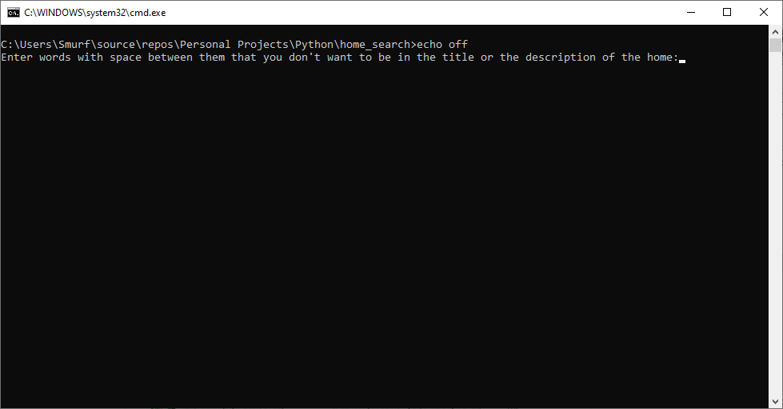
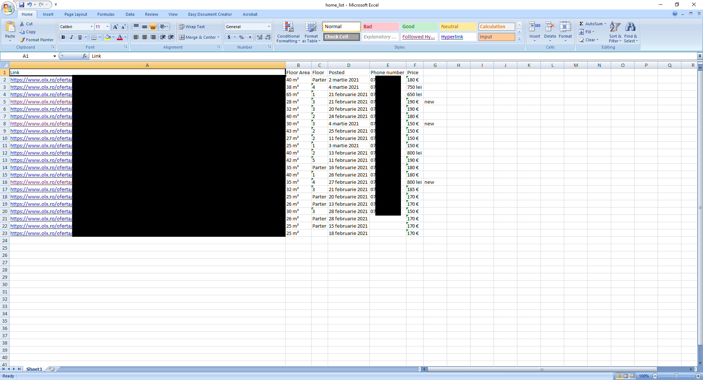

# Home-Search-olx

 <h3>Description:</h3>
 A simple Web Scraper script that searches for a home on the romanian site: https://www.olx.ro , collects data from each link and stores it in an excel file.
 
 <h3>Requirements:</h3>
 <ul>
	<li>python3</li>
	<li>selenium</li>
	<li>xlswriter</li>
	<li>time</li>
	<li>openpyxl</li>
	<li>re</li>
 </ul>
 
 <h3>How to run the script:</h3>
 <ol>
	<li>Click on "home_search.bat"</li>
	<li>Enter the words that you don't want to be in the title or the description of the home</li>
	<li>Enter the url,the domain of the site needs to be olx and you should have the search already filtered,example price,location,etc</li>
	<li>Wait until the .bat file tells you to press any key to continue then you can close the .bat file,the more pages your link has the longer it will take</li>
	<li>The excel file will be in the folder with the script</li>
 </ol>
  
 <h3>home_search.bat file:</h3>
 
 
 
 <h3>Input:</h3>
 
 
 
 <h3>Excel file:</h3>
 
 
 
 <h3>Output:</h3>
 
 
 
 Tested link: https://www.olx.ro/imobiliare/apartamente-garsoniere-de-inchiriat/sibiu/?search%5Bfilter_float_price%3Afrom%5D=100&search%5Bfilter_float_price%3Ato%5D=190&search%5Bfilter_float_m%3Afrom%5D=25&search%5Bphotos%5D=1
